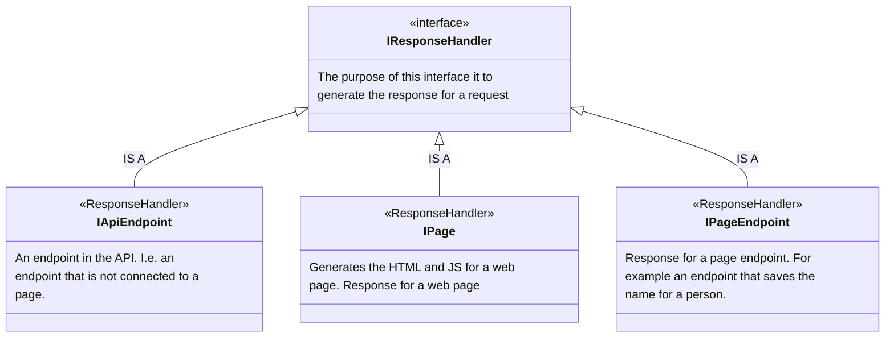
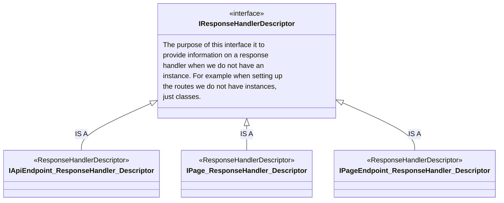
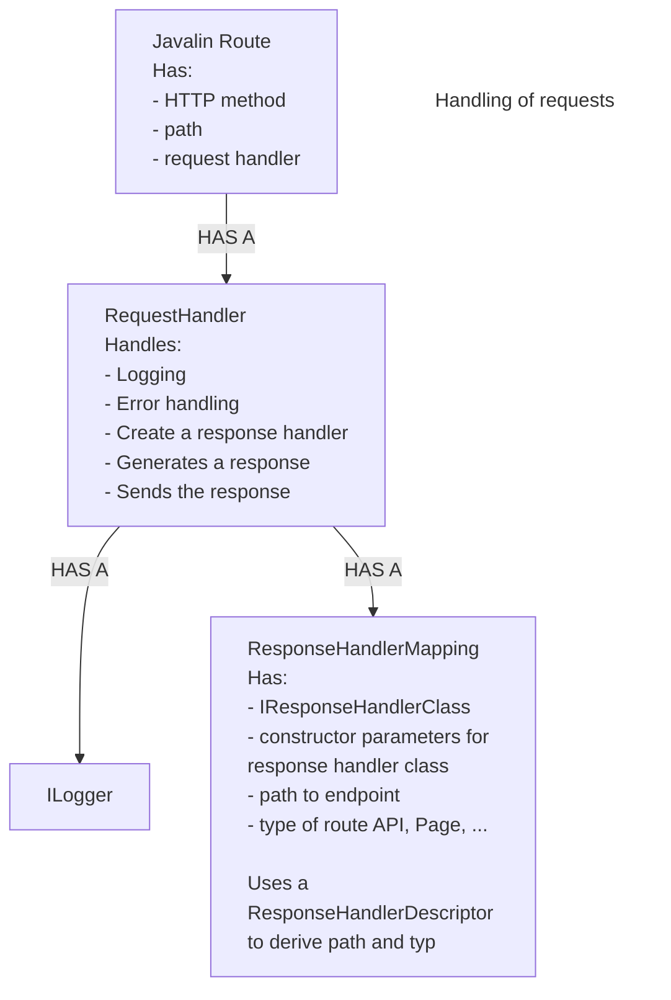

# Architecture Diagrams

This document contains the architectural diagrams for the WebBlocks framework.

## Response Handler Hierarchy

## Response Handler Descriptor Hierarchy

## Request Handling Flow

